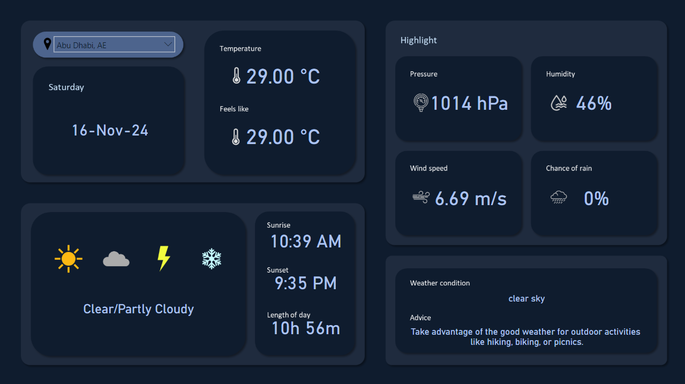

# Weather Dashboard Powered by OpenWeatherMap API

A comprehensive weather data collection and visualization process that combines Python-based data collection with Power BI analytics. The script collects weather data from 300+ major cities worldwide using OpenWeatherMap API and presents it through interactive dashboards.

&nbsp;
## Features
- Automated weather data collection from 300+ global cities from this [list](https://openweathermap.org/storage/app/media/cities_list.xlsx)
- Comprehensive weather metrics including:
  - Temperature and feels-like temperature
  - Humidity and pressure levels
  - Weather descriptions
  - Wind speed measurements
  - Precipitation probability
  - Sunrise and sunset times
- Automated MySQL database management
- Detailed logging system
- Secure credential handling

&nbsp;
## Requirements
- Python 3.7+
- MySQL Server
- OpenWeather API key
- Required Python packages:
  - requests
  - mysql-connector-python
  - python-dotenv

&nbsp;
## Installation
1. Clone this repository.
```
git clone https://github.com/johnfritzel/weather-api-dashboard.git
```

2. Create a virtual environment.
```
python -m venv venv
```

2. Activate the virtual environment.
```
venv\Scripts\activate # Windows
source venv/bin/activate  # Linux/macOS
```

4. Install required dependencies.
```
pip install -r requirements.txt
```

5. Create a .env file with the following variables:
```
DB_NAME=weather_data
DB_USER=your_username
DB_PASSWORD=your_password
DB_HOST=localhost
DB_PORT=3306
API_KEY=your_openweather_api_key
```


